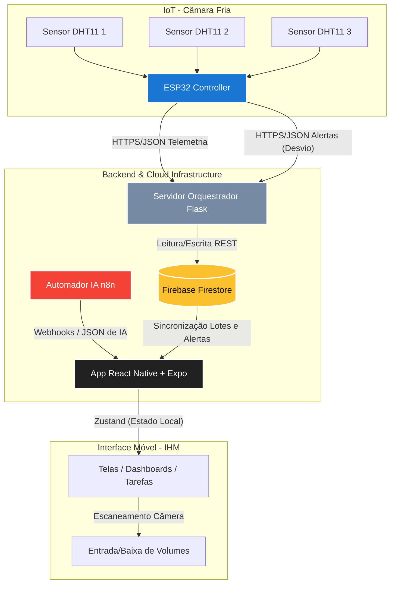

# GESTÃO DE ESTOQUE & MONITORAMENTO IoT — PANIFICADORA INDUSTRIAL

> Solução inteligente integrada (IHM Mobile + IoT + IA Acionável + Backend) projetada para otimizar a gestão de estoques físicos e o controle térmico de câmaras frias em panificações industriais.

<div align="center">
  
</div>

<br>

[](#)
[](#)

---

## 📖 O QUE É E QUAL PROBLEMA RESOLVE?

Em uma panificadora industrial, a eficiência da operação física e a conservação da matéria-prima (como leveduras, manteigas e insumos sensíveis) são críticas. A falha no controle de validade ou a variação imperceptível na temperatura de uma câmara fria podem gerar perdas financeiras severas e paradas na produção.

Este sistema foi projetado de ponta a ponta para resolver estes problemas por meio de três pilares integrados:

1. **Gestão de Validade Inteligente (FEFO)**: Substitui o controle manual ou planilhas estáticas por uma IHM (Interface Homem-Máquina) móvel que mapeia volumes físicos por código de barras e prioriza automaticamente o consumo dos lotes mais próximos do vencimento (*First Expired, First Out*).
2. **Prevenção Ativa de Falhas de IoT**: Uma câmara fria monitorada por um único sensor está exposta a leituras incorretas (se o sensor quebrar ou congelar). Nossa solução utiliza uma **rede de tripla redundância (3 sensores DHT11)** conectada a um ESP32, calculando desvios térmicos em tempo real para isolar falhas de sensores antes que a temperatura geral seja comprometida.
3. **Tomada de Decisão com IA Acionável**: Integrada a fluxos de automação no **n8n**, a aplicação converte análises de inteligência artificial em cartões interativos de ação direta no app móvel (e.g., sugerir reajustes automáticos de estoque mínimo/máximo com base na sazonalidade).

---

## 📐 ARQUITETURA DA SOLUÇÃO

O projeto funciona como um ecossistema integrado de IHM, IoT, Orquestração de Rede e Armazenamento em Nuvem. O fluxo de informações pode ser visualizado abaixo:



---

## 📁 ORGANIZAÇÃO DO REPOSITÓRIO

Para manter o projeto limpo, limítrofe e modularizado, os arquivos estão organizados na seguinte estrutura objetiva de diretórios:

```text
├── src/
│   ├── esp32/
│   │   ├── Debug/
│   │   │   └── Debug.ino             # Firmware do ESP32 com módulo de depuração e simulação ativo
│   │   └── firmware/
│   │       └── firmware.ino          # Firmware de Produção (Leitura direta e real dos sensores DHT11)
│   ├── servidor/
│   │   ├── app.py                    # Servidor orquestrador Flask (API REST)
│   │   ├── config.py                 # Configurações globais e endpoints do Firestore REST API
│   │   ├── firestore_client.py       # Cliente nativo HTTP para comunicação direta com o Firebase Firestore
│   │   ├── state.py                  # Gerenciador de cache local de telemetrias e alertas em memória
│   │   └── serviceAccountKey.json    # Credenciais seguras de acesso ao banco de dados Cloud
│   └── img/
│       └── GestãoEstoque.png         # Imagem de demonstração do sistema
└── README.md                         # Documentação principal do projeto
```

---

## 🛠️ COMPONENTES DO PROJETO

### 1. IHM Mobile (React Native + Expo Router)
O coração da operação na fábrica. Desenhado sob um **Design System industrial rígido** (paleta de alta visibilidade e contraste para ambientes fabris), ele gerencia os fluxos físicos de estoque:
*   **Controle FEFO**: Exibição visual de prioridade de lotes com base na proximidade de validade.
*   **Baixa por Código de Barras**: Scanner nativo acoplado à câmera do celular para liberação ultra-rápida de Volumes.
*   **Gestão de Tarefas com RBAC**:
    *   **Gestor**: Criação manual de tarefas, controle total de visualização, edição, deleção e aceitação/rejeição de propostas geradas por IA.
    *   **Operador**: Visualização restrita a tarefas pendentes com botão de conclusão rápida (com registro automático de e-mail e data/hora para auditoria).
*   **Cérebro Zustand**: Gerenciamento de estado local denso para reduzir custos de banda em tráfego com o Firebase.

### 2. Monitoramento IoT (ESP32 + 3x DHT11)
Instalado fisicamente na câmara fria, ele executa um algoritmo inteligente na ponta:
*   **Redundância Térmica**: Lê 3 sensores físicos diferentes em zonas distintas da câmara.
*   **Cálculo Dinâmico de Média**: Elimina leituras espúrias (*NaN*) e calcula as médias reais de Temperatura e Umidade.
*   **Alerta de Anomalia de Sensores**: Se algum sensor apresentar um desvio térmico superior a **5.0°C** ou desvio de umidade maior que **35.0%** em relação à média dos demais, um alerta com nível de severidade **CRÍTICA** é enviado imediatamente ao servidor Flask, indicando com precisão qual sensor físico está falhando para substituição imediata.
*   **Garantia de Conectividade**: Módulo de reconexão automática resiliente ao Wi-Fi para evitar perda de dados.
*   *Nota: O diretório `src/esp32/Debug` dispõe de simulações integradas para testes em bancada sem necessidade de conectar sensores reais ou aquecer fisicamente o módulo.*

### 3. Servidor Orquestrador (Flask + Google Cloud REST)
O middleware que conecta as leituras rápidas da fábrica ao banco de dados Firestore na nuvem de forma performática e otimizada:
*   **API REST**: Recebe telemetria de 2.5s em 2.5s do ESP32 e armazena os últimos logs em fila circular em memória (`state.py`), evitando sobrecarregar o Firestore com escritas repetitivas.
*   **Comunicação Firebase Nativa**: Consome diretamente a API REST do Firestore com um tradutor dinâmico de tipos Python-Firestore (`firestore_client.py`), descartando a necessidade de SDKs pesados do Google Cloud no ambiente do servidor.
*   **Alertas Persistentes**: Ao receber uma notificação de sensor anômalo do ESP32, registra instantaneamente o incidente no Firestore na coleção `alertas`, disparando notificações imediatas para a IHM dos gestores.

---

## 🚀 COMO EXECUTAR O PROJETO

### Pré-requisitos
*   **Python 3.10+** instalado.
*   **Arduino IDE** (com suporte a placa ESP32 instalado) e as bibliotecas `DHT sensor library` e `Adafruit Unified Sensor`.
*   Arquivo de credenciais `serviceAccountKey.json` do seu projeto Firebase Firestore inserido dentro da pasta `src/servidor/`.

### Configurando o Servidor Orquestrador
1. Entre na pasta do servidor:
   ```bash
   cd src/servidor
   ```
2. Crie e ative um ambiente virtual virtualenv (opcional, porém recomendado):
   ```bash
   python -m venv venv
   # No Windows:
   .\venv\Scripts\activate
   ```
3. Instale as dependências leves:
   ```bash
   pip install Flask requests google-auth flask-cors
   ```
4. Execute o servidor:
   ```bash
   python app.py
   ```
   *O terminal exibirá os IPs locais e de rede. Anote o IP da rede (por exemplo, `http://192.168.1.15:8081`) para configurar no ESP32.*

### Gravando o ESP32
1. Abra a **Arduino IDE**.
2. Escolha qual versão deseja carregar:
   *   **Para Testes de Bancada**: Abra o arquivo `src/esp32/Debug/Debug.ino`.
   *   **Para Instalação Real na Câmara**: Abra o arquivo `src/esp32/firmware/firmware.ino`.
3. Ajuste as credenciais de Wi-Fi nas linhas 10 e 11:
   ```cpp
   const char* WIFI_SSID = "SEU_WIFI";
   const char* WIFI_PASSWORD = "SUA_SENHA";
   ```
4. Configure as URLs com o IP do seu servidor Flask (anotado no passo anterior) nas linhas 13 e 14:
   ```cpp
   const char* PYTHON_TELEMETRIA_URL = "http://IP_DO_SEU_SERVIDOR:8081/api/esp32/telemetria";
   const char* PYTHON_ALERTA_URL     = "http://IP_DO_SEU_SERVIDOR:8081/api/esp32/alertas";
   ```
5. Conecte o ESP32 ao computador, selecione a placa e a porta correspondentes e clique em **Upload**.

---

<div align="center">
  <br>
  <em>"A tecnologia industrial serve para amplificar as capacidades humanas, garantindo segurança e constância onde o esforço manual falha."</em>
  <br>
  <strong>— Engenharia de Produção & IoT</strong>
  <br><br>
</div>
